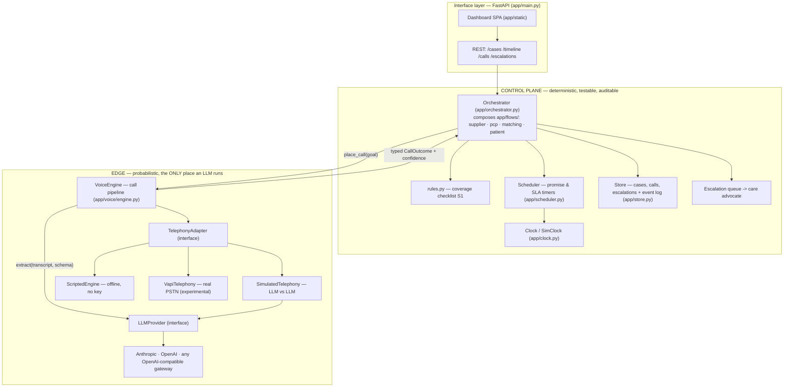
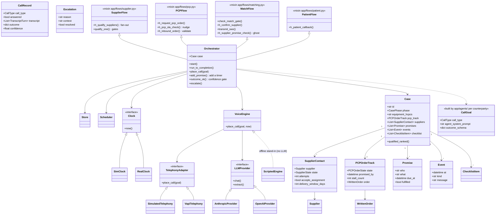
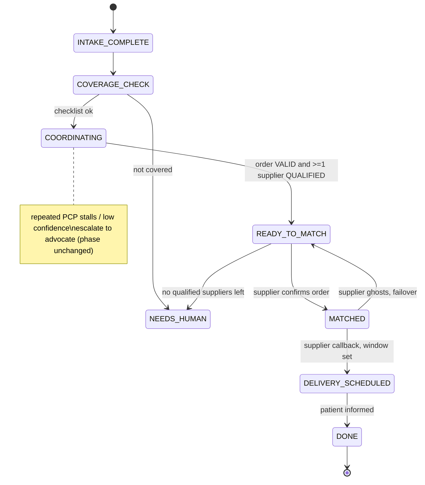
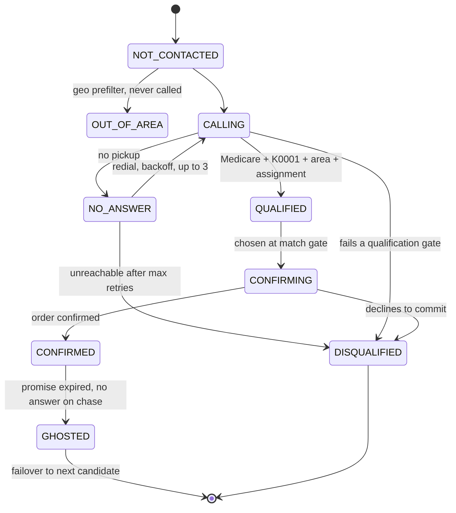
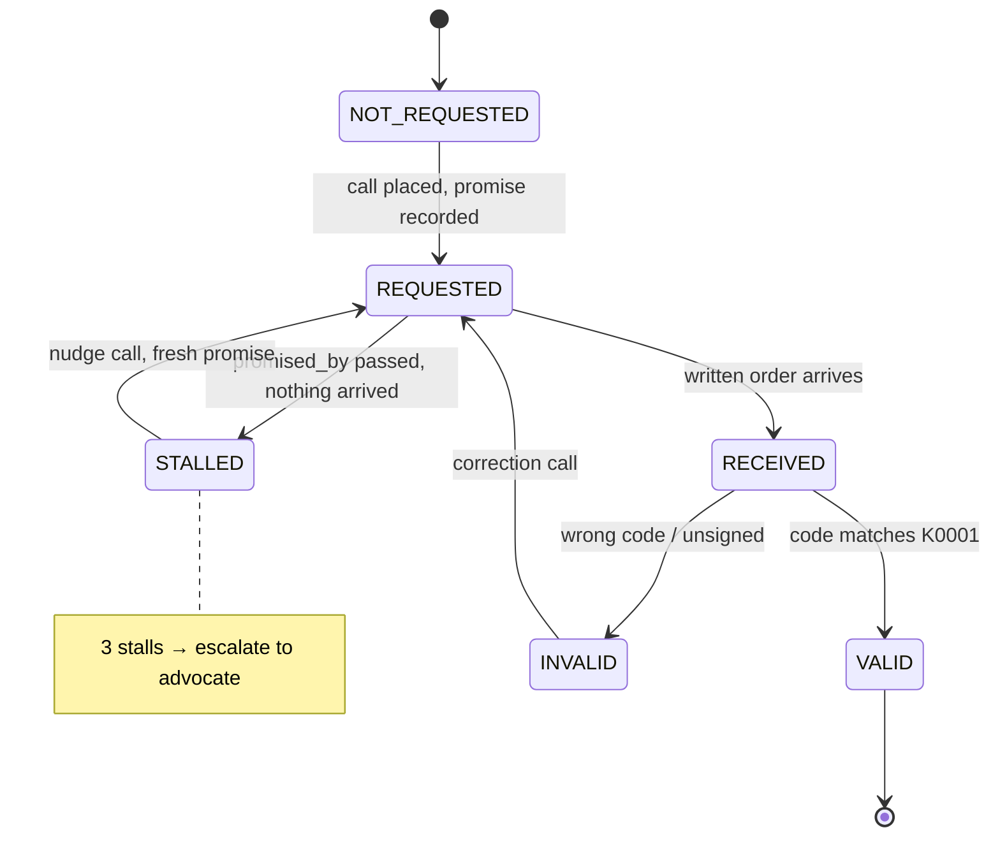
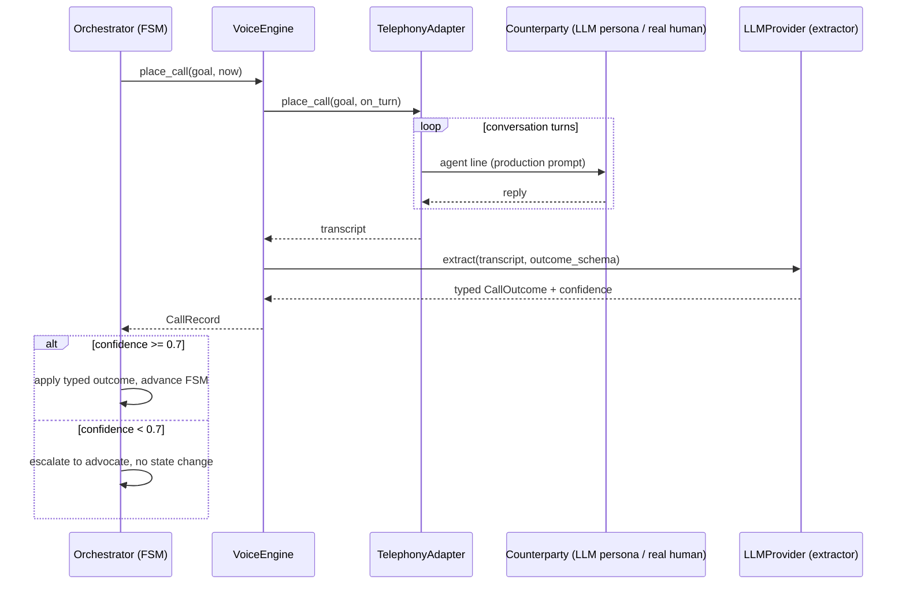
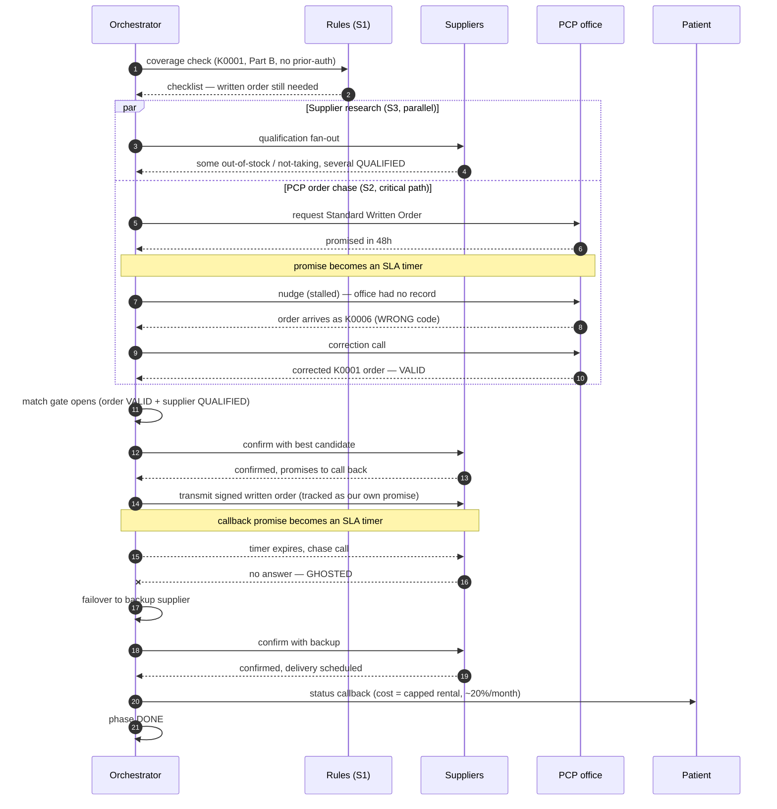

# Diagrams

Visual companion to [DESIGN.md](DESIGN.md). All diagrams are Mermaid (GitHub
renders them inline). They reflect the actual code in `app/`.

---

## 1. System architecture — FSM at the center, LLM only at the edges

The one idea the whole system is built on: **deterministic control flow owns the
workflow; the LLM is confined to the two jobs code can't do** — holding a phone
conversation and turning it into structured facts.

---

## 2. Class diagram — domain model + services

The domain models (`app/models.py`) are the shared type system; the service
classes wire the edges to the FSM. `<<interface>>` marks the swap seams.

---

## 3. Case state machine (top level)

The whole case as one FSM. `NEEDS_HUMAN` is reachable from any working state —
escalation is a first-class outcome, not an error path.

---

## 4. Supplier sub-state-machine (one per engaged supplier)

Note the two failure branches that matter most: retry-with-backoff on no-answer,
and `GHOSTED` — which is simply a confirmed supplier whose promise timer expired.

---

## 5. PCP written-order sub-state-machine

The two brief failure modes live here: "we never got it" (STALLED → nudge) and
"wrong billing code" (RECEIVED → INVALID → correction call).

---

## 6. Sequence — the call pipeline (the core primitive)

Every outbound interaction is this exact shape. Talker and parser are separate
LLM passes; the confidence gate decides whether the FSM may act.

---

## 7. Sequence — Eleanor's case end-to-end (the interesting path)

Shows the concurrency (S2 ∥ S3), the wrong-code bounce, and the
ghost-then-failover.

